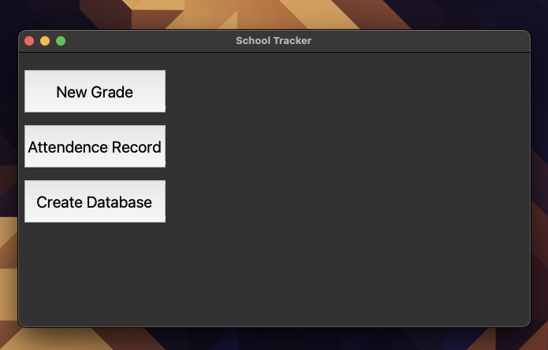
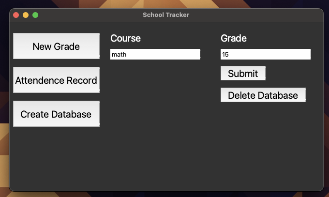
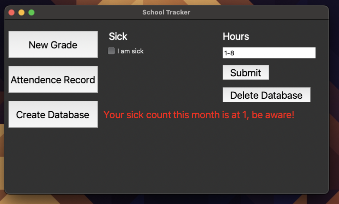

# School Attendence Record

### Why do I created this project?

I need a way to be able to see my sick days,
because of the rules we have at school.
I never had serious problems with attending classes,
but there are sometimes short months where the sick days
accumulate very fast.

### GUI

I am thinking about making a GUI for this as well.
That way it is more userfriendly, I guess.

## This is how it looks
#### The default view is empty

#### When you click on Grades, you will see this layout

#### When you click on Attendence, you will see this layout
